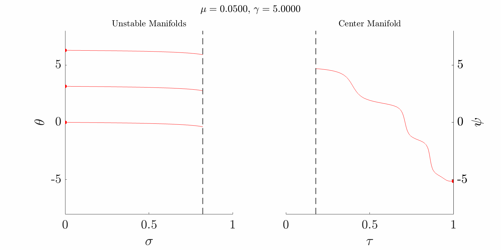

# Schrödinger Operators Interacting at Two Distinct Scales

<!--**Note: The main files have been temporarily removed from this repository.**-->

This directory contains the computational codes associated with the paper: "ON THE SPECTRUM OF SCHRÖDINGER OPERATORS INTERACTING AT TWO DISTINCT SCALES"

  

## Overview
This repository contains six main MATLAB scripts that implement numerical simulations cross three distinct parameter regimes. Each case studies the dynamical behavior through phase portrait analysis and trajectory computation in transformed coordinate systems.

<!---->

## Usage Restrictions
These codes are provided for research reproducibility and verification purposes. Any use of these codes must:
1. Properly cite the original paper
2. Obtain written permission from the authors for any commercial use
3. Include appropriate attribution in any derivative work

## Citation
If you use these codes in your research, please cite: [Paper citation details to be added]

## License
Copyright (C) 2025 Emmanuel Fleurantin
All rights reserved.

This code is made available under restricted terms. Redistribution and use require explicit permission from the authors.
